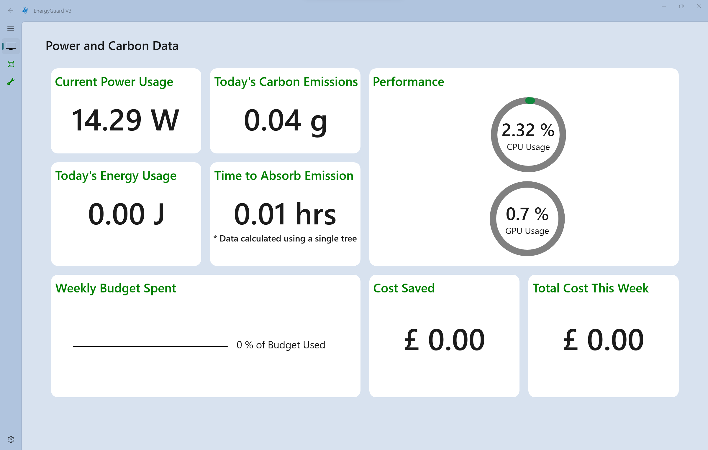

# **EnergyGuard Version 3**

**Empowering Efficiency, Shaping Sustainability**

Inflation has driven energy costs in the UK to unprecedented levels, prompting heightened cost consciousness among consumers.

Designed with sustainability in mind, EnergyGuard Version 3 empowers users to monitor and reduce their energy consumption while decreasing their carbon footprint. It offers a user-centric design and intuitive interface, facilitating clear insights into energy usage and carbon emissions through a comprehensive dashboard design. Real-time monitoring capabilities enable immediate adjustments for optimised energy efficiency, while the new design ensures better visualisation of data.

## <u>Latest Features in EnergyGuard Version 3</u> 

1. Smart Billing Rates
2. Day and Nighttime Detection
3. Cost Saved Feature
4. Tracking Total Carbon Emissions
5. Real-time Carbon Intensity Data
6. Carbon Offest Value
7. Multi-GPU Support
8. In-game Overlay with Xbox Game Bar

## <u>Run EnergyGuard</u>

1. Clone the repository.
2. Open **EnergyGuard**.
3. Follow the instructions in the **README.md** file.

## <u>Run EnergyGuard Widget</u>

1. If the repository is not cloned, clone the repository.
2. Open **EnergyGuardWidget**.
3. Follow the instructions in the **README.md** file.

Project group code: **ENERGY1-2023**
